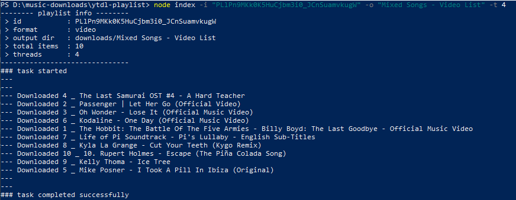

# Youtube Playlist Downloader

Download Youtube playlist videos as video or audio with command line tool.

### Prerequisites

```
node >= 8.9.0

ffmpeg (for audio)
```

### Built With

* [Node](https://nodejs.org) - Javascript run-time environment
* [Youtube Data Api](https://developers.google.com/youtube/v3/docs/) Youtube Data Api
* [Ytdl Core](https://github.com/fent/node-ytdl-core) YouTube video downloader in javascript
* [FFMPEG](https://ffmpeg.org/download.html) - Multimedia framework, able to decode, encode, transcode, vs.
* [Fluent-ffmpeg](https://github.com/fluent-ffmpeg/node-fluent-ffmpeg) A fluent API to FFMPEG
* [Got](https://github.com/sindresorhus/got) Simplified HTTP requests
* [Joi](https://github.com/hapijs/joi) Object schema validation
* [Commander](https://github.com/tj/commander.js) Node.js command-line interfaces made easy
* [Clui](https://github.com/nathanpeck/clui) Command-line UI toolkit for Node.js

### Install

clone this repo, then
```
npm install
```

### Youtube Data API Key
Take your api key from [here](https://developers.google.com/youtube/v3/docs/) and set **app.api_key** property in the [package.json](https://github.com/m-cakir/ytdl-playlist/blob/master/package.json) file.

## Usage

`node index [options]`

__Options__

       -v, --version                  version number
       -h, --help                     help
       -f, --format                   output format (video || audio), default: video
       -o, --output                   output folder name, default: playlist name
       -u, --url                      youtube playlist url (overrides "id" option)
       -i, --id                       youtube playlist id
       -r, --range                    playlist items range, must be like a-b
       -j, --json                     options from .json file (overrides other options)
       -t, --threads                  amount of concurrent downloads

__Options json file format__

"id" or "url" must be valid, you can't set both. Other options have default values (see --help output).

```
{
    "id": "PLlPn9MKk0K5HuCjbm3i0_JCnSuamvkugW",
//  "url": "https://www.youtube.com/watch?v=9OIjPKLuu5g&list=PLlPn9MKk0K5HuCjbm3i0_JCnSuamvkugW&index=10&t=0s",
    "range": [5, 10],
    "format": "audio",
    "output": "My Playlist XYZ"
}
```

## Examples

__Basic__
```
node index -i "PLlPn9MKk0K5HuCjbm3i0_JCnSuamvkugW"
```

__Via playlist url__
```
node index -u "https://www.youtube.com/watch?v=9OIjPKLuu5g&list=PLlPn9MKk0K5HuCjbm3i0_JCnSuamvkugW&index=10&t=0s"
```

__Save as audio (bitrate: 192kbps)__
```
node index -i "PLlPn9MKk0K5HuCjbm3i0_JCnSuamvkugW" -f "audio"
```

__Output folder name__
```
node index -i "PLlPn9MKk0K5HuCjbm3i0_JCnSuamvkugW" -o "My Playlist XYZ"
```

__Save items by range__
```
node index -i "PLlPn9MKk0K5HuCjbm3i0_JCnSuamvkugW" -r 5-10
```

__Options from file__
```
node index -j "../json/playlist.json"
```

## Screenshots





